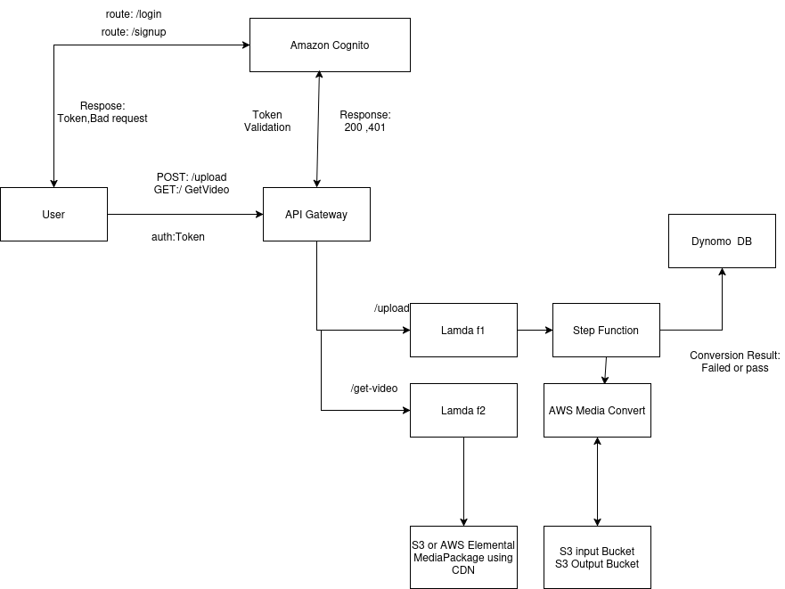

# AWS-Node-Cognito-template-OpenID-connect

A robust Node.js application template demonstrating AWS Cognito integration with OpenID Connect for authentication and video upload/streaming capabilities.

## Features

- 🔐 AWS Cognito Authentication using OpenID Connect
- 📹 Video Upload to S3
- 🎥 Video Streaming with HLS
- 🎨 Modern UI with responsive design
- 🚀 Express.js backend
- 🔄 Session Management
- 📱 Mobile-friendly interface

## Prerequisites

- Node.js >= 18.0.0
- AWS Account
- AWS Cognito User Pool
- AWS S3 Bucket
- AWS API Gateway setup

## Environment Variables

Create a `.env` file in the root directory:

```plaintext
AWS_ACCESS_KEY_ID=your_aws_access_key
AWS_SECRET_ACCESS_KEY=your_aws_secret_key
AWS_REGION=us-east-1
COGNITO_USER_POOL_ID=your_user_pool_id
COGNITO_CLIENT_ID=your_client_id
COGNITO_CLIENT_SECRET=your_client_secret
COGNITO_DOMAIN=your_cognito_domain
SESSION_SECRET=your_session_secret
API_GATEWAY_URL=your_api_gateway_url
PORT=3000
```

## Installation

```bash
# Clone the repository
git clone [repository-url]

# Install dependencies
npm install

# Create uploads directory
mkdir uploads

# Start the server
npm start
```

## Project Structure

## Architecture



The above diagram illustrates the system architecture:
- Authentication flow using AWS Cognito
- File upload process through API Gateway and S3
- Video processing with MediaConvert
- Content delivery using CloudFront

